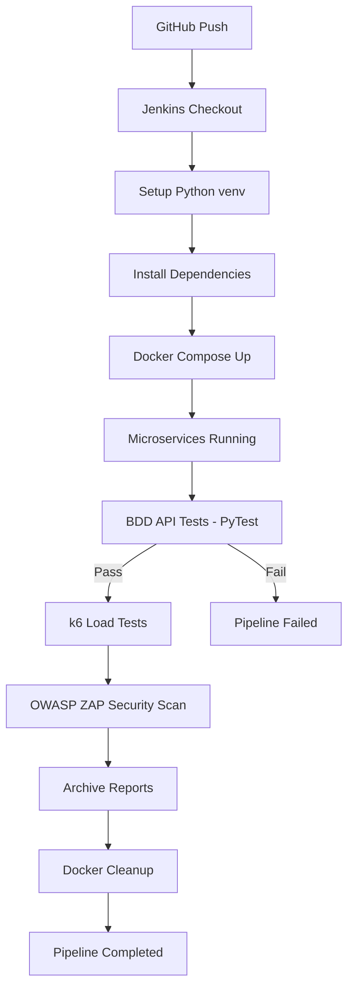

This project demonstrates a real-world DevOps QA pipeline for validating a microservices-based checkout system.

The pipeline is implemented using Jenkins (Pipeline as Code) and validates quality, performance, and security before any deployment.

**CI Pipeline Stages**

1️. Source Checkout

 Jenkins pulls the latest code from GitHub

 Pipeline defined in Jenkinsfile

2️. Environment Setup

 Python virtual environment created

 Dependencies installed from requirements.txt

 Fully reproducible CI environment

3️. Infrastructure Provisioning

 Microservices started using Docker Compose

 Services:

	-Product Service

	-Inventory Service

	-Cart Service

	-Payment Service

	-Order Service

	-UI Service

4️. Functional Quality Gate – API (BDD)

 PyTest + pytest-bdd

 End-to-end business flows validated:

    -Successful checkout

    -Payment failure handling

    -Inventory consistency

 Results exported as JUnit XML

 Reports archived in Jenkins

5️. Performance Testing

 k6 load testing

 Executed inside Docker network

 Validates system behavior under load

 JSON metrics archived as artifacts

6️. Security Testing

 OWASP ZAP baseline scan

 Detects common vulnerabilities:

    -Missing headers

    -Insecure configurations

 CI-safe (non-blocking)

 Security reports archived

7. UI Testing (optional / extensible)

 Selenium & Playwright supported

 Headless execution in CI

 Designed for browser-based quality gates

8️. CI Hygiene

 Test reports archived automatically

 Docker containers cleaned up after each run

-Pipeline fails only on real quality violations

 9. CI/CD Pipeline Flow Diagram

GitHub automatically renders this diagram.

10. Test Reports & Artifacts

Jenkins archives the following artifacts on each run:

 PyTest JUnit reports

 k6 performance metrics

 OWASP ZAP security reports

 These artifacts enable:

 Traceability

 Auditing

 Quality gate enforcement

**Why this project matters**

This repository showcases:

 DevOps mindset
 CI/CD ownership
 Test automation at scale
 Microservices testing
 Performance & security awareness

**Next Enhancements (Planned)**

 GitHub Actions CI (parallel to Jenkins)

 Docker Hub image publishing

 Kubernetes deployment (k3d / kind)

 Centralized observability (Grafana)

 Quality Gate dashboard
